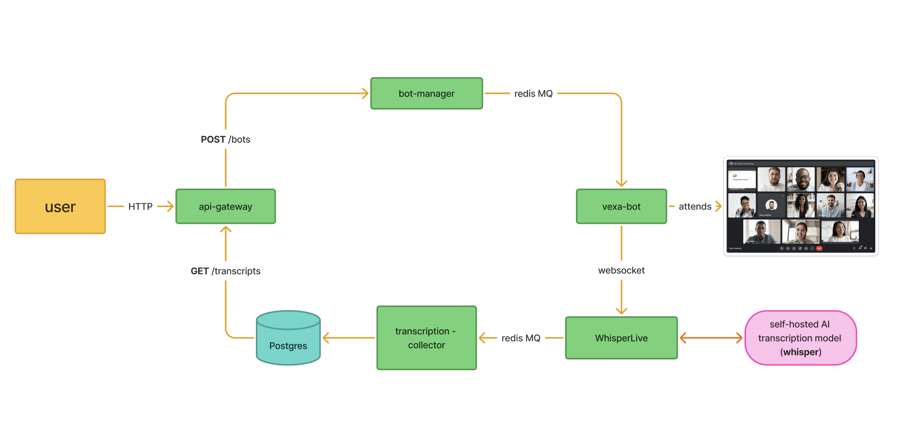

<p align="left">
  
</p>

  [](DEPLOYMENT.md) [](DEPLOYMENT.md)

# Vexa: API for **Real-Time Meeting Transcription**


<p align="center">
  <b>🚀 Help us reach 1000 stars! 🚀</b><br>
  <b>Current:  → Goal: 1000 ⭐️</b><br>
  <a href="https://github.com/Vexa-ai/vexa/stargazers">

  </a>
</p>


💬 [Join Discord Community!](https://discord.gg/Ga9duGkVz9)

Vexa is an API for **real-time meeting transcription** using **meeting bots** and direct **streaming from web/mobile apps**. It extracts knowledge from various platforms including:

- **Google Meet**
- **Zoom** (coming soon)
- **Microsoft Teams** (coming soon)

It serves as an **privacy-first**, **open source** alternative to `recall.ai`.

It focuses on doing one job well: **clean, private, real-time transcription under your control so you can safely build on top**.


## Build on Top. In Hours, Not Months


**Build powerful meeting assistants (like Otter.ai, Fireflies.ai, Fathom) for your startup, internal use, or custom integrations.**

The Vexa API provides powerful abstractions and a clear separation of concerns, enabling you to build sophisticated applications on top with a safe and enjoyable coding experience. 

For instance, the **Vexa Example Client** (see [Projects Built with Vexa](BUILT-WITH-VEXA.md)) was built in just 3 hours of live coding with Cursor, showcasing the rapid development possible with Vexa.

Furthermore, with our **n8n integration** (see [Projects Built with Vexa](BUILT-WITH-VEXA.md) for examples), you can create incredibly complex workflows with no code, leveraging real-time transcription from Google Meet (with support for other platforms coming soon).

<p align="center">
  
</p>


- [api-gateway](./services/api-gateway): Routes API requests to appropriate services
- [bot-manager](./services/bot-manager): Handles bot lifecycle management
- [vexa-bot](./services/vexa-bot): The bot that joins meetings and captures audio
- [WhisperLive](./services/WhisperLive): Real-time audio transcription service
- [transcription-collector](./services/transcription-collector): Processes and stores transcription segments
- [Database models](./libs/shared-models/shared_models/models.py): Data structures for storing meeting information


## Public Hosted API

> 🔑 Get your API key at [www.vexa.ai](https://www.vexa.ai/?utm_source=github&utm_medium=readme&utm_campaign=vexa_repo) to try Vexa instantly. 

> 🚀 Read [DEPLOYMENT.md](DEPLOYMENT.md) for self-hosting and local run with single `make all` on CPU even on laptop or on your GPU server.

The Vexa API is **publicly available** at [www.vexa.ai](https://www.vexa.ai/?utm_source=github&utm_medium=readme&utm_campaign=vexa_repo) with **self-service access** - get your API key in just 3 clicks and have everything running in under 5 minutes.


### Key features in this release:

- **Instant API Access**: Self-service API keys available directly from [www.vexa.ai](https://www.vexa.ai/?utm_source=github&utm_medium=readme&utm_campaign=vexa_repo)
- **Google Meet Bot Integration**: Programmatically send bots to join and transcribe meetings
- **Real-Time Transcription**: Access meeting transcripts as they happen through the API
- **Real-Time Translation**: Change the language of transcription to get instant translations across 99 languages


## API Capabilities


## Simple API Integration
**Set up and running in under 5 minutes**

Get your API key in 3 clicks at [www.vexa.ai](https://www.vexa.ai/?utm_source=github&utm_medium=readme&utm_campaign=vexa_repo) and start using the API immediately.

### Create a meeting bot
```bash
# POST /bots
curl -X POST https://gateway.dev.vexa.ai/bots \
  -H "Content-Type: application/json" \
  -H "X-API-Key: YOUR_API_KEY" \
  -d '{
    "native_meeting_id": "xxx-xxxx-xxx",
    "platform": "google_meet"
  }'
```

### Retrieve meeting transcript
```bash
# GET /transcripts/{platform}/{native_meeting_id}
# Example assumes native_meeting_id is derived from the meeting URL
curl -H "X-API-Key: YOUR_CLIENT_API_KEY" \
  https://gateway.dev.vexa.ai/transcripts/google_meet/xxx-xxxx-xxx
```

```json
{
  "data": {
    "meeting_id": "meet_abc123",
    "transcripts": [
      {
        "time": "00:01:15",
        "speaker": "John Smith",
        "text": "Let's discuss the quarterly results."
      },
      {
        "time": "00:01:23",
        "speaker": "Sarah Johnson",
        "text": "The Q3 revenue exceeded our projections by 15%."
      },
      {
        "time": "00:01:42",
        "speaker": "Michael Chen",
        "text": "Customer acquisition costs decreased by 12% from last quarter."
      }
    ]
  }
}
```

## Projects Built with Vexa

To see examples of projects built using the Vexa API, including our example client and other community contributions, please see the [BUILT-WITH-VEXA.md](BUILT-WITH-VEXA.md) file.

> 💫 If you're building with Vexa, we'd love your support! [Star our repo](https://github.com/Vexa-ai/vexa/stargazers) to help us reach 600 stars.

### Features:
- **Real-time multilingual transcription** supporting **99 languages** with **Whisper**
- **Real-time translation** across all 99 supported languages
- (**Note:** Additional features like LLM processing, RAG, and MCP server access are planned - see 'Coming Next')


## Current Status

- **Public API**: Fully available with self-service API keys at [www.vexa.ai](https://www.vexa.ai/?utm_source=github&utm_medium=readme&utm_campaign=vexa_repo)
- **Google Meet Bot:** Fully operational bot for joining Google Meet calls
- **Real-time Transcription:** Low-latency, multilingual transcription service is live
- **Real-time Translation:** Instant translation between 99 supported languages
- **Pending:** Speaker identification is under development

## Coming Next

- **Microsoft Teams Bot:** Integration for automated meeting attendance (June 2025)
- **Zoom Bot:** Integration for automated meeting attendance (July 2025)
- **Direct Streaming:** Ability to stream audio directly from web/mobile apps
- **Real-time LLM Processing:** Enhancements for transcript readability and features
- **Meeting Knowledge Extraction (RAG):** Post-meeting analysis and Q&A
- **MCP Server:** Access to transcription data for agents

## Self-Deployment

For **security-minded companies**, Vexa offers complete **self-deployment** options.

To run Vexa locally on your own infrastructure, the primary command you'll use after cloning the repository is `make all`. This command sets up the environment (CPU by default, or GPU if specified), builds all necessary Docker images, and starts the services. 

[3 min video tutorial](https://www.youtube.com/watch?v=bHMIByieVek)

Detailed instructions: [Local Deployment and Testing Guide](DEPLOYMENT.md).

## Contributing

Contributors are welcome! Join our community and help shape Vexa's future. Here's how to get involved:

1.  **Understand Our Direction**:
    *   Check out the **project roadmap** to see where we're headed: [Vexa Project Roadmap](https://github.com/orgs/Vexa-ai/projects/1)

2.  **Engage on Discord** ([Discord Community](https://discord.gg/Ga9duGkVz9)):
    *   **Introduce Yourself**: Start by saying hello in the introductions channel.
    *   **Stay Informed**: Check the Discord channel for known issues, feature requests, and ongoing discussions. Issues actively being discussed often have dedicated channels.
    *   **Discuss Ideas**: Share your feature requests, report bugs, and participate in conversations about a specific issue you're interested in delivering.
    *   **Get Assigned**: If you feel ready to contribute, discuss the issue you'd like to work on and ask to get assigned on Discord.

3.  **Development Process**:
    *   Browse available **tasks** (often linked from Discord discussions or the roadmap).
    *   Request task assignment through Discord if not already assigned.
    *   Submit **pull requests** for review.

- **Critical Tasks & Bounties**:
  - Selected **high-priority tasks** may be marked with **bounties**.
  - Bounties are sponsored by the **Vexa core team**.
  - Check task descriptions (often on the roadmap or Discord) for bounty details and requirements.

We look forward to your contributions!


## Project Links

- 🌐 [Vexa Website](https://vexa.ai)
- 💼 [LinkedIn](https://www.linkedin.com/company/vexa-ai/)
- 🐦 [X (@grankin_d)](https://x.com/grankin_d)
- 💬 [Discord Community](https://discord.gg/Ga9duGkVz9)

[](https://www.linkedin.com/in/dmitry-grankin/)

[](https://discord.gg/Ga9duGkVz9)

## License

[](https://opensource.org/licenses/Apache-2.0)

Vexa is licensed under the **Apache License, Version 2.0**. See [LICENSE](LICENSE) for the full license text.

The Vexa name and logo are trademarks of **Vexa.ai Inc**.
